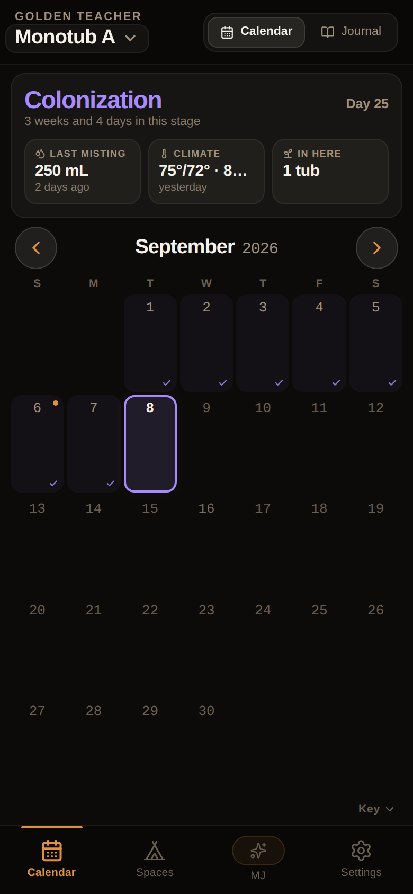
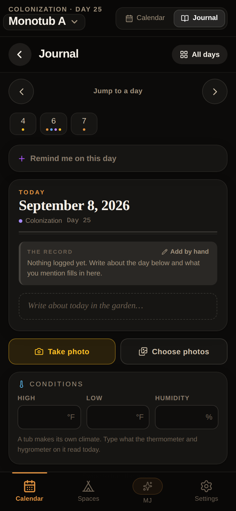
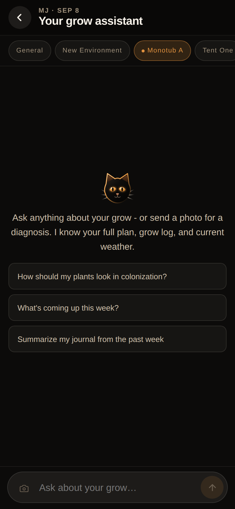
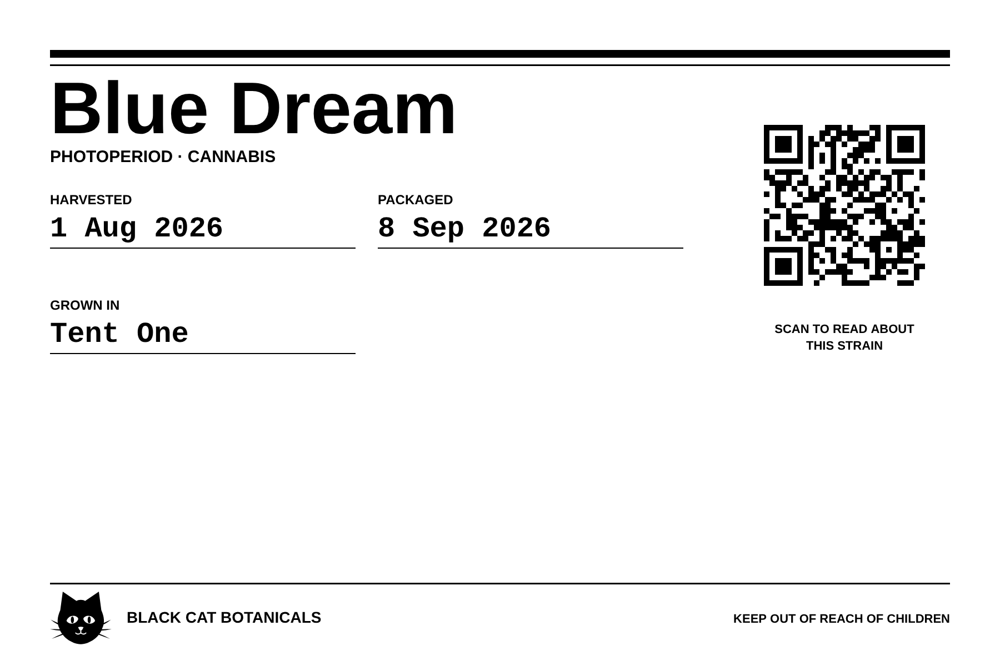

<div align="center">


<br />

**A grow journal for cannabis and mushrooms that runs on my phone and prints its own jar labels.**

[](https://github.com/p-Iggsray/grow-calendar/actions)


</div>

## Open it

**https://grow-calendar.priggs32304.workers.dev**

```
https://grow-calendar.priggs32304.workers.dev
```

Add it to your home screen and it behaves like a native app. There is one account and no sign up, so if you are not me you get the login screen and nothing else. The rest of this page is what sits behind it.

---

## What this is

I grow a few plants and a couple of monotubs, and I got tired of losing track of what I did on which day. Spreadsheets went stale, notes apps turned into a pile of undated text, and none of it knew what a monotub was.

So this is the thing I actually use. A calendar where every day holds what happened, a journal that reads my own writing and pulls the numbers out of it, and a label printer for the jars at the end. It covers cannabis and mushrooms on the same stage ladder, because I run both and did not want two apps.

It is a single tenant app. One login, my data, no multi user anything. The code is here if you want to run your own copy.

<div align="center">



</div>

---

## What it does

**The calendar** shows one space at a time. The card at the top is the state of that space right now: the stage, how long it has been in it (in weeks and days, because "day 25" stops meaning anything after a while), the last watering, the last climate reading, what is in there. Days that have a record are filled in. Days ahead are not, because I do not know what happens on them yet.

**The journal** is the part I use most. Each day is a page. Write about the day in normal English, and the app reads the entry and fills in the log: how much water, what feed, temperature, humidity, trichome color. Anything it takes from your writing is marked as read from the entry rather than typed, so you can always tell what you actually recorded and what the app inferred. Nothing is guessed silently.

**Watering is per plant.** Type an amount once and apply it to every plant, or give each one its own. Gallons, liters or milliliters, stored canonically and read back in whatever unit you typed.

**Spaces.** A tent and a monotub are different places with different stages and different vocabulary. The app knows a monotub gets misted and holds tubs, and a tent gets watered and holds plants. Seventeen stages across the two crops, one ordered ladder, and the stage history is built from what you actually recorded rather than from a plan you wrote in March.

**MJ** is the assistant. It runs on Gemini 2.5 Flash and it can see the whole space: every stage change and when, the journal, the daily log, the weather, what is growing. It answers questions and it can write to the log if you ask it to. The API key lives in the Worker and never reaches the browser.

**Weather** comes from the National Weather Service, with Open Meteo for history. Threats are filtered by stage, so you are told about frost in flower and not about it in December.

**Photos** attach to a day or to a plant, stored in D1 with a thumbnail alongside the full size so a grid of them does not pull megabytes.

**The report** exports the whole grow as one self contained HTML file, built for printing: a contents page, the journal day by day, and a photo section organized into dated plates so you can watch the thing grow on paper.

**A buddy link** shares a read only view. No account needed on their end, revocable, and it does not expose your notes.

---

## Labels

The strain screen has a Save Print Label button. It draws a 6 by 4 inch label at 300 dpi in pure black on white, which is what a thermal printer actually wants: no greys, no tints, hierarchy from weight and rule thickness only. It saves to the camera roll and prints from there.

Every field is editable before you print, because a label is a claim about a specific jar and only the person holding it knows the weight. Terpenes and percentages, potency, harvest and package dates, which space it was grown in.

<div align="center">

</div>

The QR goes to a public page for that strain at `/s/<name>`, written once by the assistant and cached forever. It is about the variety and nothing else. Hand somebody a jar and they can read what the strain is; they cannot read your grow. The page never touches a user row.

The QR encoder is written from scratch in `src/lib/qr.js`: Reed Solomon over GF(256), all eight data masks with the standard penalty scoring, BCH coded format bits, versions 1 through 10. No dependency, and it is tested against a decoder rather than by looking at it, which is how three separate bugs got caught that all produced codes that scanned fine.

---

## How it is built

| Layer | What |
|---|---|
| Frontend | React 18 and Vite, no UI framework, CSS custom properties for theming |
| Backend | Cloudflare Workers |
| Database | Cloudflare D1 (SQLite at the edge) |
| Assistant | Google Gemini 2.5 Flash, called from the Worker |
| Auth | Cookie sessions, PBKDF2 with a per user salt |
| Motion | framer-motion |
| Icons | lucide-react |
| Deploy | Wrangler, GitHub Actions on push to main |

Four runtime dependencies. The QR encoder, the label renderer, the report generator and the brand mark are all in this repo rather than pulled in.

---

## Running it yourself

Node 18 or newer.

```bash
git clone https://github.com/p-Iggsray/grow-calendar.git
cd grow-calendar
npm install
npx wrangler d1 execute grow-calendar-db --local --file=./schema.sql
```

Then two terminals:

```bash
npm run dev        # Vite on http://localhost:5173
npx wrangler dev   # Worker plus local D1 on http://localhost:8787
```

Open http://localhost:5173. Vite proxies `/api/*` to the Worker, so login and syncing work against the local database. Running `npm run dev` on its own gives you the frontend with every API call returning 404.

The seeded local account is `test` / `testpass123`. It is local only and separate from anything deployed.

### Secrets

| Name | Required | What it is |
|---|---|---|
| `GEMINI_API_KEY` | yes, for MJ | Google AI Studio key. Set with `npx wrangler secret put GEMINI_API_KEY`. Without it the assistant is off and the rest of the app works. |
| `CF_AI_GATEWAY_URL` | no | Routes Gemini calls through a Cloudflare AI Gateway for logging and caching. |

Deploy setup, the schema, migrations and the auth model are in **[DEV.md](DEV.md)**.

---

## Tests

```bash
npm test     # 418 tests, node:test, no framework
npm run lint
```

CI runs lint, tests and a build on every push and pull request, then deploys main.

The tests cover the parts where being wrong is expensive and invisible: the QR encoder against a decoder, the stage ladder, water unit conversion both directions, the provenance marking on prose that gets read into the log, and the label fold. There is also a test that fails if the app icon stops being the same cat as the rest of the app, and one that fails on an em dash anywhere in the source.

---

## Security

- Passwords are PBKDF2 with a per user salt.
- Session cookies are HttpOnly, Secure, SameSite=Lax.
- Every mutating endpoint checks `content-type: application/json`, which blocks form based CSRF.
- Share tokens are 24 bytes of crypto randomness, base64url.
- The public strain page reads no user row at all, and only generates a profile for a name that is already in the catalog, so an open endpoint cannot be used to burn quota on arbitrary text.
- Client errors post to `/api/errors` with a per session cap so a render loop cannot flood the log.

---

## License

There isn't one yet, which legally means all rights reserved. Read it, learn from it, run your own copy. If you want to do something else with it, ask me.

<div align="center">
<br />

<br /><br />
<sub>Athens, Ohio</sub>
<br /><br />
</div>
